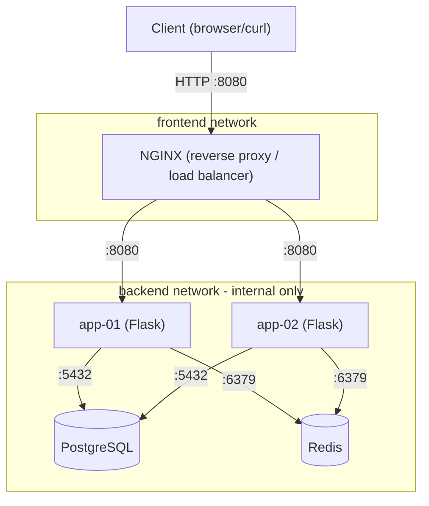

# Architecture Diagram

## Description
- **NGINX** is the single public entry point (port 8080 on the host), load-balancing
  requests round-robin across two identical Flask application instances.
- **app-01 / app-02** are stateless Flask instances — all durable state lives in PostgreSQL
  and Redis, not in the app containers themselves.
- **PostgreSQL** stores persistent records (`/records` endpoint), backed by a named Docker
  volume for durability across container recreation.
- **Redis** stores ephemeral counter state (`/counter` endpoint).
- The `backend` Docker network is marked `internal: true`, so PostgreSQL and Redis are not
  directly reachable from outside the Docker network — only through the app containers.
